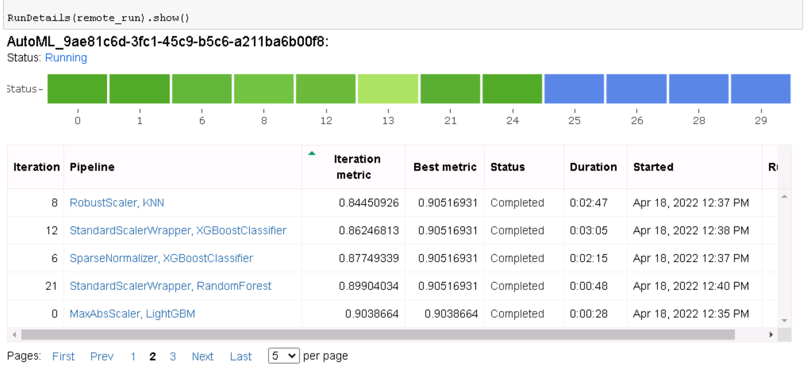

# Heart Failure Prediction
## Udacity Azure Machine Learning Nanodegree Capstone Project

Heart failure is a common event caused by Cardiovascular diseases which is the #1 cause of death globally, taking an estimated 17.9 million lives each year (31% of all deaths worlwide).  This project uses [Heart Failure Clinical Data](https://www.kaggle.com/datasets/andrewmvd/heart-failure-clinical-data) to predict a death event caused by heart failure.  This dataset contains 12 clinical features for predicting death events based on medical records of 299 patients.

In this Udacity Azure Machine Learning Nanodegree Capstone project, I created two models: one using Automated ML (denoted as AutoML from now on) and one customized model whose hyperparameters are tuned using HyperDrive. I then compared the performance of both the models and deployed the best performing model.  This project used an [external datasets](https://www.kaggle.com/datasets/andrewmvd/heart-failure-clinical-data) and trained a model using different tools available in the AzureML framework as well as deploying the model as a web service.

## Project Workflow


### Project Main Steps:

1. [Project Set Up and Installation](#setup)
2. [Dataset](#dataset)
	* Overview
	* Task
	* Access
3. [Automated ML](#automl)
	* Overview
	* Results
4. [Hyperparameter Tuning](#hyper)
	* Overview
	* Results
5. [Model Deployment](#deploy)
	* Overview
	* Instructions on how to query the endpoint
6. [Documentation Video](#video)
7. [Future Improvements](#future)
8. [Acknowledgements](#ack)

## Step 1: Project Set Up and Installation<a name="setup"></a>

* Create a new workspace in Microsoft Azure Machine Learning Studio
* Create Compute Instance called automl-inst using STANDARD_DS12_V2
* Use the Compute Instance terminal and type:
```
git clone https://github.com/camille-wilkens/AZ_Capstone.git --depth 1
```
* Open automl.ipynb and execute all the cells
* Open hyperparameter_tuning.ipynb and execute all the cells


## Step 2: Dataset<a name="dataset"></a>

### Overview
This project uses an external dataset from Kaggle - [Heart Failure Clinical Data](https://www.kaggle.com/datasets/andrewmvd/heart-failure-clinical-data). This dataset contains 12 features that can be used to predict mortality by heart failure. It contains medical records of 299 patients 

```
Dataset from Davide Chicco, Giuseppe Jurman: “Machine learning can predict survival of patients with heart failure from serum creatinine and ejection fraction alone. BMC Medical Informatics and Decision Making 20, 16 (2020)
```

### Features & Target

| Name | Description | Type|
|:--------------:|:-------------:|:--------------:|
| age | Age of Patient| Years|
| anaemia | Decrease of red blood cells or hemoglobin| (boolean)|
| creatinine_phosphokinase | Level of the CPK enzyme in the blood| (mcg/L)|
| diabetes | If the patient has diabetes| (boolean)|
| ejection_fraction| Percentage of blood leaving the heart at each contraction| (percentage)|
| high_blood_pressure| If the patient has hypertension| (boolean)|
| platelets| Platelets in the blood | (kiloplatelets/mL)|
| serum_creatinine| Level of serum creatinine in the blood  | (mg/dL)|
| serum_sodium| Level of serum sodium in the blood   | (mEq/L)|
| sex| Woman or man  | binary|
| smoking| If the patient smokes or not  | (boolean)|
| time| Follow-up period  | (days)|
| TARGET: DEATH_EVENT| If the patient deceased during the follow-up period | (boolean)|

#### Task

The task involves predicting the Death Event (if the patient deceased during the follow-up period) based on the other 12 features available (see above).  Using Classification, AutoML will predict Death Event and the Hyperdrive model will use Logistic Regression to predict Death Event

#### Access

In AutoML, a Jupyter Notebook (automl.ipynb) reads the dataset using Dataset.Tabular.from_delimited_files and registers the data in the workspace.
```
found = False
key = "Heart_Prediction_Dataset"
description_text = "Heart Prediction Dataset"

if key in ws.datasets.keys(): 
        found = True
        dataset = ws.datasets[key] 

if not found:
        # Create AML Dataset and register it into Workspace
        example_data = 'https://raw.githubusercontent.com/camille-wilkens/AZ_Capstone/main/heart_failure_clinical_records_dataset.csv'
        dataset = Dataset.Tabular.from_delimited_files(example_data)        
        #Register Dataset in Workspace
        dataset = dataset.register(workspace=ws,
                                   name=key,
                                   description=description_text)
```
                        
                        
In the Hyperdrive model, a Jupyter Notebook (hyperparameter_tuning.ipynb) reads the dataset using train.py which creates a TabularDataset using TabularDatasetFactory. 

## Step 3: Automated ML<a name="automl"></a>
### Overview 

I have used the following automl settings this experiment:

| Name | Setting | Description|
|:--------------:|:-------------:|:--------------:|
| Experiment Time| 30 | Maximum amount of time that all iterations combined can take before the experiment terminates. |
| Max Concurrent Iterations| 5 | Represents the maximum number of iterations that would be executed in parallel.|
| Number of Cross Validations| 25 | How many cross validations to perform when user validation data is not specified.|
| Primary Metric| AUC Weighted| The metric that Automated Machine Learning will optimize for model selection.|


I have used the following automl configuration for this experiment:
| Name | Setting | Description|
|:--------------:|:-------------:|:--------------:|
| Task| Classification | The type of task to run. Values can be 'classification', 'regression', or 'forecasting' depending on the type of automated ML problem to solve.|
| Label Column | `DEATH_EVENT`| Column to be Predicted |
| Early Stopping | Enabled| Whether to enable early termination if the score is not improving in the short term. |
| Auto Features | Enabled| FeaturizationConfig Indicator for whether featurization step should be done automatically or not, or whether customized featurization should be used. Note: If the input data is sparse, featurization cannot be turned on. |


automl settings and configuration utlized in this experiment  
```
automl_settings = {
    "experiment_timeout_minutes": 30,
    "max_concurrent_iterations": 5,
     "n_cross_validations": 25,
     "primary_metric" : 'AUC_weighted'
}
```

```

automl_config = AutoMLConfig(compute_target=compute_target,
                             task = "classification",
                             training_data=dataset,
                             label_column_name="DEATH_EVENT",   
                             enable_early_stopping= True,
                             featurization= 'auto',
                             debug_log = "automl_errors.log",
                             **automl_settings
                            )
```

### Results
VotingEnsemble with an accurary of 83.5% and AUC Weighted of 92% was the best model

### Best Run
```
best_run,fitted_model = remote_run.get_output()
best_run_metrics = best_run.get_metrics() 

print("Best Run:",best_run.id)
print(best_run)
print("Fitted Model:", fitted_model)
print("Fitted Model Steps:")
print(fitted_model.steps)
print("Best Run Metrics")
print(best_run_metrics)

for i in best_run_metrics:
    x = best_run_metrics[i]
    print(i,x )
```

```
Best Run: AutoML_9ae81c6d-3fc1-45c9-b5c6-a211ba6b00f8_38
Run(Experiment: ml-experiment-1,
Id: AutoML_9ae81c6d-3fc1-45c9-b5c6-a211ba6b00f8_38,
Type: azureml.scriptrun,
Status: Completed)
Fitted Model: Pipeline(memory=None,
         steps=[('datatransformer',
                 DataTransformer(enable_dnn=False, enable_feature_sweeping=True, feature_sweeping_config={}, feature_sweeping_timeout=86400, featurization_config=None, force_text_dnn=False, is_cross_validation=True, is_onnx_compatible=False, observer=None, task='classification', working_dir='/mnt/batch/tasks/shared/LS_root/mount...
                 PreFittedSoftVotingClassifier(classification_labels=array([0, 1]), estimators=[('16', Pipeline(memory=None, steps=[('minmaxscaler', MinMaxScaler(copy=True, feature_range=(0, 1))), ('extratreesclassifier', ExtraTreesClassifier(bootstrap=True, ccp_alpha=0.0, class_weight=None, criterion='gini', max_depth=None, max_features=None, max_leaf_nodes=None, max_samples=None, min_impurity_decrease=0.0, min_impurity_split=None, min_samples_leaf=0.01, min_samples_split=0.056842105263157895, min_weight_fraction_leaf=0.0, n_estimators=50, n_jobs=1, oob_score=False, random_state=None, verbose=0, warm_start=False))], verbose=False)), ('28', Pipeline(memory=None, steps=[('maxabsscaler', MaxAbsScaler(copy=True)), ('gradientboostingclassifier', GradientBoostingClassifier(ccp_alpha=0.0, criterion='mse', init=None, learning_rate=0.01, loss='deviance', max_depth=10, max_features='log2', max_leaf_nodes=None, min_impurity_decrease=0.0, min_impurity_split=None, min_samples_leaf=0.035789473684210524, min_samples_split=0.5252631578947369, min_weight_fraction_leaf=0.0, n_estimators=600, n_iter_no_change=None, presort='deprecated', random_state=None, subsample=0.7631578947368421, tol=0.0001, validation_fraction=0.1, verbose=0, warm_start=False))], verbose=False)), ('17', Pipeline(memory=None, steps=[('minmaxscaler', MinMaxScaler(copy=True, feature_range=(0, 1))), ('extratreesclassifier', ExtraTreesClassifier(bootstrap=False, ccp_alpha=0.0, class_weight='balanced', criterion='gini', max_depth=None, max_features=0.9, max_leaf_nodes=None, max_samples=None, min_impurity_decrease=0.0, min_impurity_split=None, min_samples_leaf=0.01, min_samples_split=0.01, min_weight_fraction_leaf=0.0, n_estimators=25, n_jobs=1, oob_score=False, random_state=None, verbose=0, warm_start=False))], verbose=False)), ('1', Pipeline(memory=None, steps=[('maxabsscaler', MaxAbsScaler(copy=True)), ('xgboostclassifier', XGBoostClassifier(n_jobs=1, problem_info=ProblemInfo(gpu_training_param_dict={'processing_unit_type': 'cpu'}), random_state=0, tree_method='auto'))], verbose=False)), ('24', Pipeline(memory=None, steps=[('standardscalerwrapper', StandardScalerWrapper(copy=True, with_mean=False, with_std=True)), ('extratreesclassifier', ExtraTreesClassifier(bootstrap=False, ccp_alpha=0.0, class_weight='balanced', criterion='gini', max_depth=None, max_features=None, max_leaf_nodes=None, max_samples=None, min_impurity_decrease=0.0, min_impurity_split=None, min_samples_leaf=0.01, min_samples_split=0.056842105263157895, min_weight_fraction_leaf=0.0, n_estimators=200, n_jobs=1, oob_score=False, random_state=None, verbose=0, warm_start=False))], verbose=False)), ('5', Pipeline(memory=None, steps=[('standardscalerwrapper', StandardScalerWrapper(copy=True, with_mean=True, with_std=False)), ('kneighborsclassifier', KNeighborsClassifier(algorithm='auto', leaf_size=30, metric='cityblock', metric_params=None, n_jobs=1, n_neighbors=29, p=2, weights='distance'))], verbose=False))], flatten_transform=None, weights=[0.2, 0.2, 0.1, 0.1, 0.3, 0.1]))],
         verbose=False)
```


#### Screenshots

#### RunDetails widget (shows progress of training runs of the different experiments): 


#### Best Model with Run ID (VotingEnsemble): 

#### Best Model Metrics (VotingEnsemble): 


#### Improvement Areas

* Increase the number of cross validations
* Spend more time on preparing the data, adding more patient data
* Try a different primary metric
* Increase the Experiment Timeout


## Step 4: Hyperparameter Tuning<a name="hyper"></a>
#### Overview
I utilized a Scikit-learn Logistic Regression Model for Classification on this HyperDrive experiment.


##### Hyperparameter Sampling
I used RandomParameterSampling as it supports continous and discrete hyperparamters.  Another key benefit of using RandomParameterSampling, is its less resource intensive and time consuming and supports early termination.

I have used these two hyperparameters:

| Name | Ranges | Description|
|:--------------:|:-------------:|:--------------:|
| "--C"| choice(0.5,1.0) | Inverse of regularization strength; must be a positive float|
| "-max_iter"| choice(0.5,1.0) |Maximum number of iterations taken for the solvers to converge|


```

"--C":choice(0.5,1.0),     
"--max_iter":choice(50,100,150)

```


##### Early Stopping Policy
The Early Stopping policy, I utilized was the Bandit Policy is also less resource intensive and time consuming.  If a run's performance is outside the best run's slack_factor, the run is early terminated -- saving time and resources.


#### Hyperparamater Tuning
```
hyperdrive_config = HyperDriveConfig (
        hyperparameter_sampling=ps,
        primary_metric_goal=PrimaryMetricGoal.MAXIMIZE,
        primary_metric_name='Accuracy',
        policy=policy,
        max_total_runs=8, 
        max_concurrent_runs=4,
        estimator=est)
```
           
#### Results

Hyperdrive experiment received an accuracy score of 80%
```
best_run.get_file_names()
best_run_metrics

```
```
{'Regularization Strength:': 0.5, 'Max iterations:': 150, 'Accuracy': 0.8}
```
#### Screenshots

#### RunDetails widget (shows progress of training runs of the different experiements): 


#### Hyperdrive Best Run

#### Hyperdrive Best Run Metrics

#### Hyperdrive Best Run Metrics


#### Improvement Areas
Changing the sampling type to either GRID or Bayesian sampling could improve the model.


## Step 5: Model Deployment<a name="deploy"></a>

#### Overview

The AutoML Model out performed the HyperDrive model and was the model I chose to deploy. 

Using the best run's model from AutoML, I followed these steps:
* Saved the model
* Captured the conda environment of the best run - project_environment.yml
* Created a scoring script called score.py
* Registered the best run's model (which created model.pkl file)
* Created an Inference Configuration using the score.py and project_environment.yml (generated from the best run)
* Created the Deployment Config
* Lastly, deployed the model as webservice - heart-failure-service, using ACI (Azure Container Instance) 

#### [Steps to Deploy a Model](https://docs.microsoft.com/en-us/azure/machine-learning/how-to-deploy-and-where?tabs=python)

* Register the model.
* Prepare an inference configuration.
* Prepare an deployment configuration.
* Deploy the model as a web service to the cloud.
* Test the resulting web service.

#### Instructions on how to query the endpoint

The following cell shows how to query the endpoint:
```

import json
import requests


test = {
  "data": [ {
      "age": 90,
      "anaemia": 0,
      "creatinine_phosphokinase": 500, 
      "diabetes":  1,
      "ejection_fraction": 150,
      "high_blood_pressure": 0,
      "platelets": 100000,
      "serum_creatinine": 2.75,
      "serum_sodium": 140,
      "sex": 1,
      "smoking": 0,
      "time": 500 },
      
      {"age": 45,
      "anaemia": 1,
      "creatinine_phosphokinase": 500, 
      "diabetes":  1,
      "ejection_fraction": 50,
      "high_blood_pressure": 1,
      "platelets": 100000,
      "serum_creatinine": 1.75,
      "serum_sodium": 140,
      "sex": 0,
      "smoking": 1,
      "time": 213}
  ]
}


test_data = json.dumps(test)
```

Returns the following:
```
[0, 0]
```
#### Screenshots

#### Testing the Response using the Notebook


#### Testing the response using Microsoft Azure Machine Learning - Endpoints


## Step 7: Documentation Video<a name="video"></a>

[YouTube Video](https://youtu.be/0H7VXiSataA)


## Acknowledgements<a name="ack"></a>


#### Citation
Davide Chicco, Giuseppe Jurman: Machine learning can predict survival of patients with heart failure from serum creatinine and ejection fraction alone. BMC Medical Informatics and Decision Making 20, 16 (2020). (link)

#### License
CC BY 4.0

